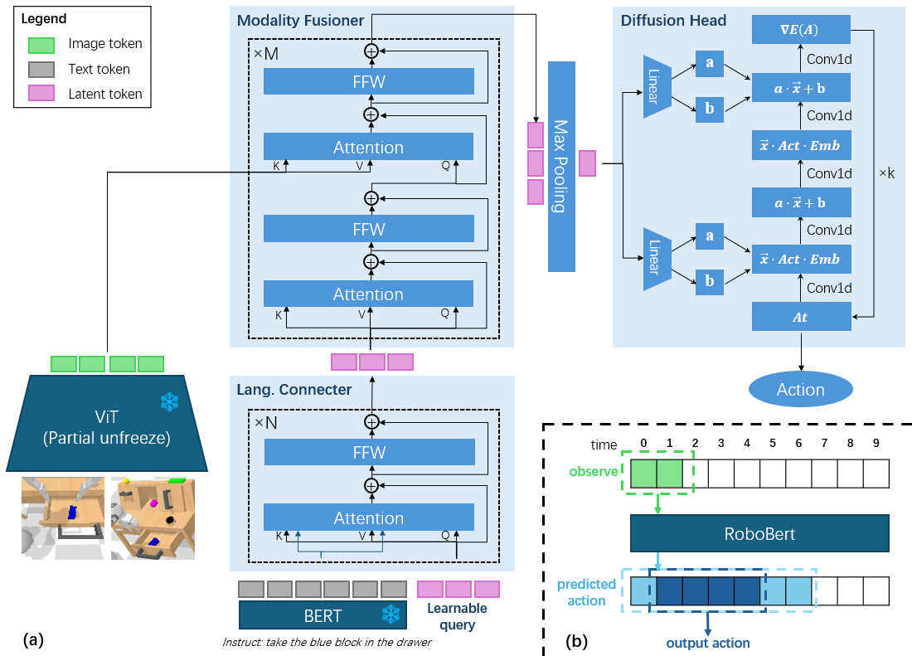
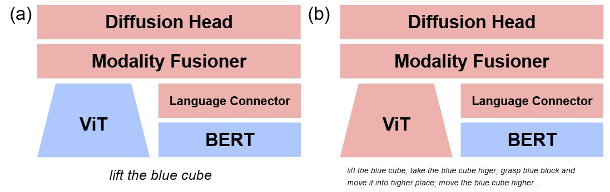
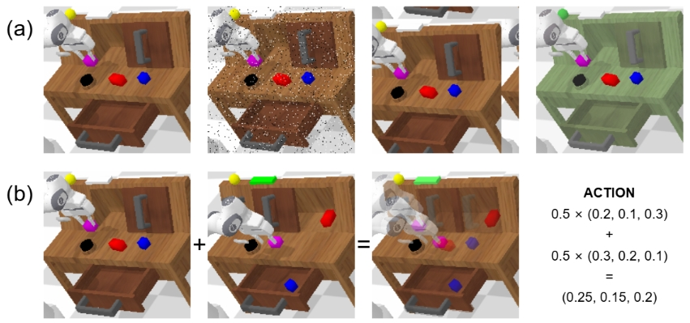

# RoboBERT
This is the official implementation of RoboBERT, which is a novel end-to-end multiple-modality robotic operations training framework. It allows an instruction-following agent, switching the policy by natural language input. The model itself is an extension or improvement of the traditional CNN-based diffusion policy, adding some creative training methods. For examples, two-stage training separates learning of different modalities; data-augmentation reduces the reliance of extra data, etc. The training framework has been tested on changllenging CALVIN benchmark and get the SOTA comparing to models without using large pretraining or extra dataset on ABCD -> D. Additionally, it also only use the trajectories with language labels. Based on these reasons, the model is much more easily to train. The repository shows the training/testing source code for repeative experiments. If you want to learn more about this work, please check our [paper](https://arxiv.org/abs/2502.07837). Thank you!

## 	:eyes: Model Features

The structure of the model is the combination of cross-attention and diffusion policy. The BERT and ViT plays the role of preprocessing of input modalities. The resulted vectors will be amalgamated and compressed into one token by cross-attention and max pooling. The token is the denoising condition for diffusion policy.
<div align="center">
  
</div>

For reducing the learning difficulties, the NLP task and action task will be studied in different stages. For fisrt stage like (a) in following graph, we use the simple and stable label for the same categories task like a warm-up. In the second stage like (b), we will use the completed natural language label to train.

<div align="center">
  
</div>

The data augmentation is quite important whe using the limited data for end-to-end training. The various data augmentation techiques are employed and demonstrated as follows. (a) are common techiques for CV tasks. (b) is mixup for robotic task. It worthy noting that not all data augmentations have the positive effect to the model like translation. In the latest experiment, Mixup is only applied during the training of subset ABC_D because mixup don't have an evident improvement for ABCD_D subset but it improve a lot for ABC_D subset. It always needs more epoches to get the best results so we don't use it for ABCD_D.

<div align="center">
  
</div>


## :technologist: Usage
Although the project and related libraries have been confirmed to run successfully on Windows, it is found that some libraries like Pyhash is difficult to compile and some performance loss for the model may also occurr on Windows, Linux is strongly recommended.

### :cd: Downloading Dataset and Pertraining
Please downloading the dataset on [CALVIN](https://github.com/mees/calvin) and BERT encoder on [BERT](https://huggingface.co/google-bert/bert-base-uncased/tree/main). 

### :wave: Cloning this Repository and Configurating Environment
```bash
git clone https://github.com/PeterWangsicheng/RoboBERT
cd RoboBERT
conda create --name RoboBERT python=3.8
conda activate RoboBERT
pip install -r requirements.txt
```
Then, modifing the pathes in ```config_path.json```, replacing pathes of CALVIN dataset and BERT as where they are in your computer.

### :family_man_boy: Extracting the Actions from Dataset
Because the training reads actions data, which is not very large in total, but more frequently than image data. It can reduce the I/O frequency and extend the harddisk life if all the action data can be restored in RAM before training cycle. We have created a script sparating or extracting the actions data individually from original CALVIN dataset and restoring into a pkl file called    ```dataset_wo_image_{dataset_name}.pkl ```.

```bash
python sparate_action_data.py --dataset_name ABCD_D --sparate_mode language
```
```--sparate_mode language``` means only sparate the trajectories with language labels. During the training, the RGB observations and actions are read from original CALVIN and extracted file respectively. 

You can also directly download the .pkl file we have prepared [ABC_D](https://drive.google.com/file/d/1Lplb7nAVspYo9wBsEk5axbF3_IULhekx/view?usp=sharing) and [ABCD_D](https://drive.google.com/file/d/1fQb2R0r9s2kfpa_M3FHXSV3KDWOFa9G5/view?usp=sharing).

Whatever which methods, you need modify the ```dataset_wo_image_path``` path in ```config_path.json``` to the path containing the corresponding pkl files. 

### :weight_lifting_man: Training the Model
After all the files mentioned are prepared and their pathes are modified in ```config_path.json```, we can train our model. Taking ABCD_D subset in CALVIN as an example, you need conduct the first-stage training by using standard language.

```bash
cd my_models/DDP_training
python training.py --world_size 2 --training_mode first --dataset_name ABCD_D
```

It will generate a checkpoint called ```model-9-first-ABCD_D.pt``` under the ```ckpt``` folder. Then we need to conduct the second stage training like

```bash
python training.py --world_size 2 --training_mode second --dataset_name ABCD_D --checkpoint ./model-9-first-ABCD_D.pt
```

The final mode is output as ```model-4-second-ABCD_D.pt``` in ```ckpt``` folder. 

### :mechanical_arm: Evaluating the Model
For evaulating the model, run the ```evaluation_calvin.py``` in the main path like

```bash
cd ../..
python evaluation_calvin.py --ckpt_path /to/your/ckpt/path
```
Of course, we also provide the pertrained model for you to evaluate. For ABCD -> D, downloading [checkpoint_ABCD_D](https://drive.google.com/drive/folders/1W2wtwZttrp42VWHwgd7kWOXTBmgzigsz?usp=sharing). For ABC -> D, downloading [checkpoint_ABC_D](https://drive.google.com/file/d/1f_9T6gY5Asmk12skKSdcgCczuWXmNScF/view?usp=sharing). Then, running the script like

```bash
python evaluation_calvin.py --ckpt_path /to/your/ckpt/path/model-4-second-ABCD_D-best.pt --speed_factor 0.9
python evaluation_calvin.py --ckpt_path /to/your/ckpt/path/model-14-second-ABC_D-best.pt
```
Noting that the speed factor will decerelate the motion and obtain better performance for ABCD subset. The reason why ABC do not need decerelation should be led by the application of mixup, the distruibution of the action label has been averaged to some extent and forming a natural decerelation for ABC_D subset.

## :chart_with_upwards_trend: Result

The model is tested on CALVIN dataset. In the table, pretraining column means if the method uses the large pertraining foundation model like LLM or extra dataset. Our model performs the best comparing to method without pretraining, even exceeding some with it.
### :computer: Performance for Dataset ABCD -> D
| Method | Pretraining | 1 | 2 | 3 | 4 | 5 | Avg Len |
| --- | --- | --- | --- | --- | --- | --- | --- |
| HULC | N | 0.889 | 0.733 | 0.587 | 0.475 | 0.383 | 3.06 |
| RoboFlamingo | Y | 0.964 | 0.896 | 0.824 | 0.740 | 0.660 | 4.08 |
| DeeR | Y | 0.982 | 0.902 | 0.821 | 0.759 | 0.670 | 4.13 |
| GR - 1 | Y | 0.949 | 0.896 | 0.844 | 0.789 | 0.731 | 4.21 |
| MoDE(w. per.) | Y | 0.971 | 0.925 | 0.879 | 0.835 | 0.779 | 4.39 |
| **RoboBERT(Ours)** | N | **0.988** | **0.952** | **0.911** | **0.865** | **0.809** | **4.52** |

### :computer: Performance for Dataset ABC -> D
| Method | Pretraining | 1 | 2 | 3 | 4 | 5 | Avg Len|
| --- | --- | --- | --- | --- | --- | --- | --- |
| RoboFlamingo | Y | 0.824 | 0.619 | 0.466 | 0.331 | 0.235 | 2.47 |
| DeeR | Y | 0.862 | 0.701 | 0.518 | 0.415 | 0.304 | 2.82 |
| GR - 1 | Y | 0.854 | 0.712 | 0.596 | 0.497 | 0.401 | 3.06 |
| 3D Diffuser Actor | N | 0.922 | 0.787 | 0.639 | 0.512 | 0.412 | 3.27 |
| MoDE(w/o per.) | N | 0.915 | 0.792 | 0.673 | 0.558 | 0.453 | 3.39 |
| **RoboBERT(Ours)** | N | **0.953** | **0.857** | **0.754** | **0.663** | **0.562** | **3.79** |

### :robot: Real Robot Experiments

Here demonstrates some indiviual tasks. There are stacking cubes, recovering pen and open the door.
<div align="center">
  
</div>
<div align="center">
  
</div>
<div align="center">
  
</div>


Here demonstrate some sequential tasks including transfer specified objects and operate articulated object.
<div align="center">
  
</div>

We have collected 25-30 trajectories for each subtasks by teleoperation and training on REALMAN rm-65b. The ISAAC SIM platform provides IK and shows the complete pose of the robotic arm, the natural language is input by keyboard. However, the switch of the all the tasks is control by human just like in CALVIN, which need improving by introduing the hight-level planining in the futture work.

